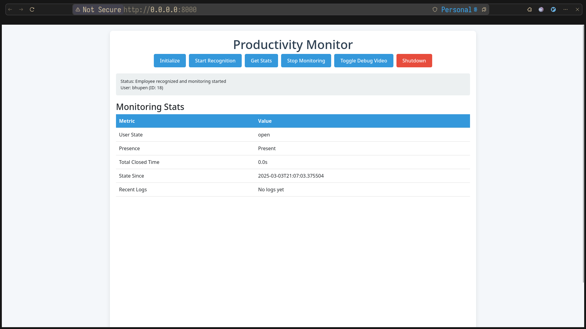
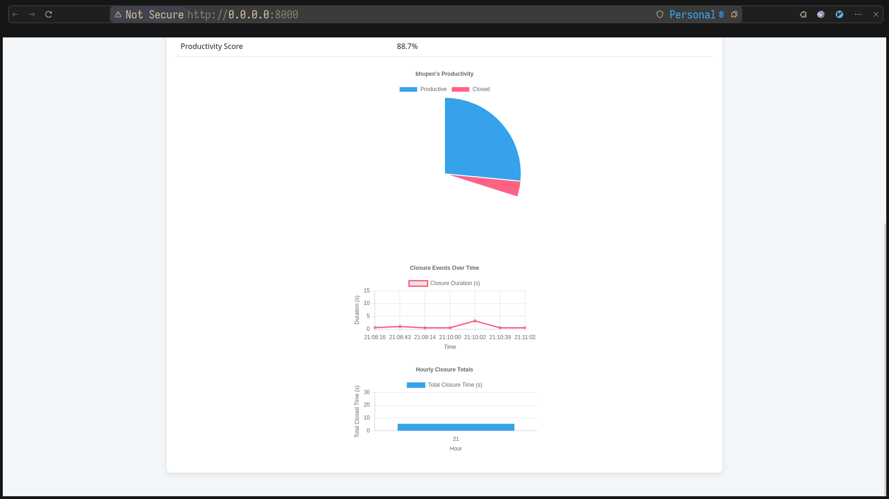
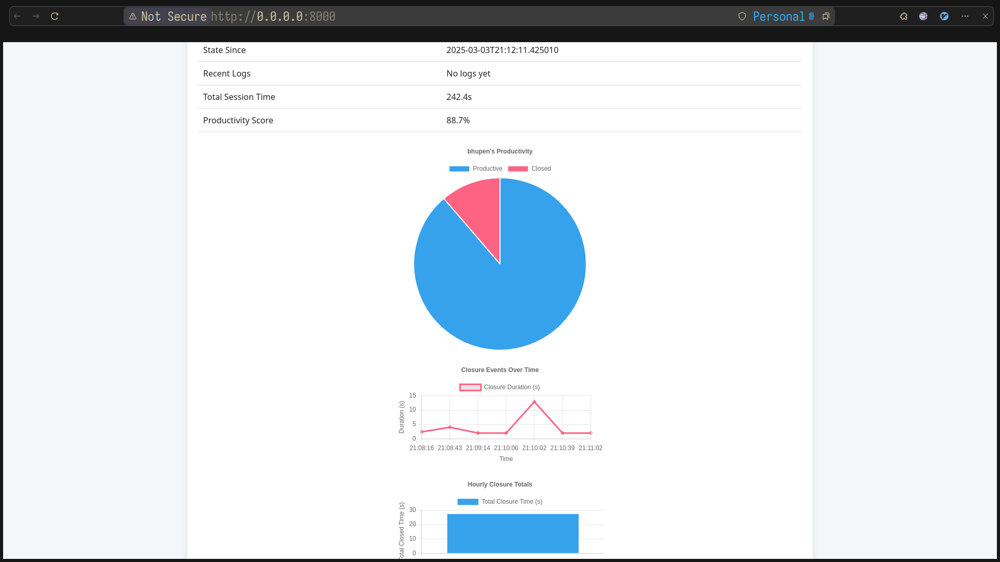
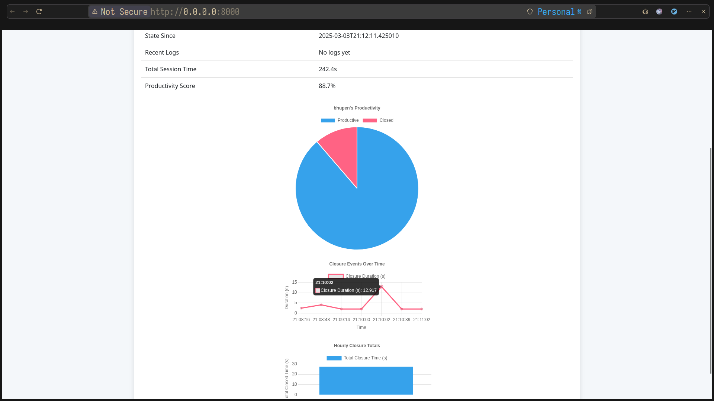

# Productivity Monitor

A real-time productivity tracking system using facial recognition and eye tracking, built with FastAPI, Python, and Chart.js. Monitors employee presence and eye closure to generate insightful productivity analytics, visualized through interactive charts.

## Features

- **Facial Recognition**: Identifies employees using pre-trained FaceNet models.
- **Eye Tracking**: Detects eye closures to measure productivity, with a 2-second threshold for logging events.
- **Real-Time Analytics**: Displays productivity metrics via:
  - **Pie Chart**: Productivity score (productive vs. closed time).
  - **Line Chart**: Timeline of closure events.
  - **Bar Chart**: Hourly closure totals.
- **Database Integration**: Logs employee data, closure events, and frame captures to MySQL.
- **Web Interface**: Intuitive UI with controls and live stats.

## Project Structure

Productivity-Monitoring/
├── app/
│ ├── config.py # Loads environment variables
│ ├── dao/ # Data access objects
│ │ └── employee*dao.py # MySQL interaction
│ ├── face_recognition/ # Core recognition and tracking
│ │ ├── detection.py # Eye tracking logic
│ │ └── recognition.py # Face recognition logic
│ ├── main.py # FastAPI application
│ ├── static/ # Frontend static files
│ │ ├── chart.js # Chart.js library
│ │ └── script.js # Chart rendering and API calls
│ ├── templates/ # HTML templates
│ │ └── index.html # Main UI with chart canvases
│ ├── utils/ # Utility functions
│ │ └── db_connection.py # MySQL connection helper
│ └── .env # Environment variables (not tracked)
├── frame_logs/ # Output frames (not tracked)
├── detected_face*\*.jpg # Detected face images (not tracked)
├── requirements.txt # Python dependencies
└── README.md # This file

## Prerequisites

- **Python 3.11**: Install via `conda` or `pyenv`.
- **MySQL**: Local server with `productivity_db` database.
- **Webcam**: For real-time face and eye detection.

## Setup

1. **Clone the Repository**:

   git clone <https://github.com/yourusername/Productivity-Monitoring.git>
   cd Productivity-Monitoring

   ```

   ```

pip install -r requirements.txt ```

```Configure Environment:

   Create app/.env:
DB_HOST=localhost
DB_PORT=3306
DB_USER=your_username
DB_PASSWORD=your_password
DB_NAME=productivity_db
```

Set Up MySQL:
sql
mysql -u your_username -p
CREATE DATABASE productivity_db;
USE productivity_db;
CREATE TABLE employees (
employee_id INT PRIMARY KEY,
name VARCHAR(255),
face_image_path VARCHAR(255)
);
INSERT INTO employees (employee_id, name, face_image_path)
VALUES (18, 'bhupen', 'app/known_faces/bhupendra.jpeg');

Run the Application:
python -m app.main

View in Browser:

Open <http://localhost:8000/>.

Usage

    Initialize: Start the webcam.
    Start Recognition: Detect your face to begin tracking.
    Get Stats: Display live productivity charts after closing eyes (2s+ threshold).
    Stop Monitoring: End the session.
    Shutdown: Use secret key bhupen to stop the server.

### Productivity Dashboard



*Pie chart, line chart, and bar chart showing productivity metrics.*

### Charts and Graphs




Pie Chart: Visualizes productivity score (productive vs. closed time).
Line Chart: Plots closure event durations over time.
Bar Chart: Shows total closure time per hour.

Output Files

    frame_logs/: Captured frames during closure events (e.g., emp_18_*.jpg).
    detected_face_*.jpg: Face detection outputs—excluded from repo via .gitignore.

Future Enhancements

    Multi-employee tracking.
    Absence duration chart.
    Exportable reports.

License

MIT License—see LICENSE for details.
Acknowledgments

    Built with dedication by Bhupen.
